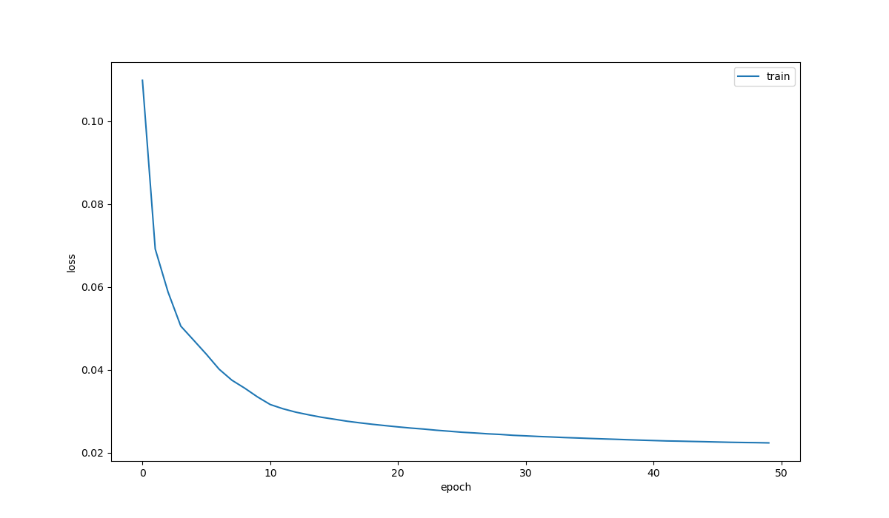
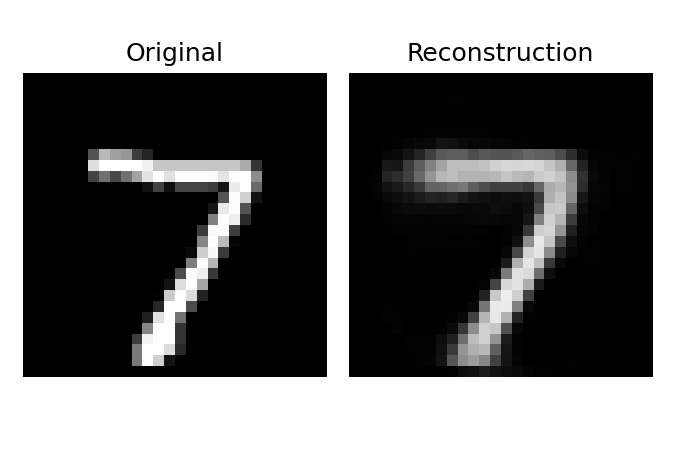
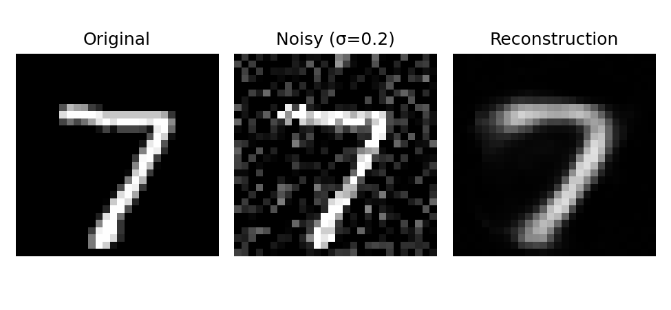
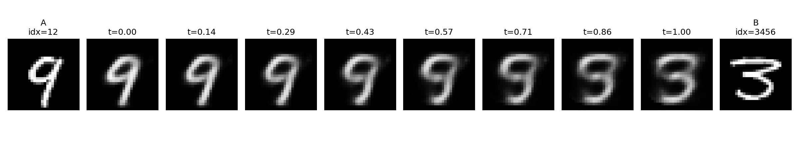

# MNIST Autoencoder: Reconstruction, Denoising & Latent Space Interpolation

<div align="center">


**A deep learning autoencoder for image reconstruction, denoising, and latent space exploration on MNIST digits.**

[Features](#-features) • [Architecture](#-architecture) • [Results](#-results) • [Usage](#-usage) • [Insights](#-key-insights)

</div>

---

## 📖 Overview

This project implements a **4-layer MLP Autoencoder** trained on the MNIST handwritten digit dataset. The autoencoder learns to compress 784-dimensional images (28×28 pixels) into a compact latent representation and reconstruct them with high fidelity.

Beyond simple reconstruction, this project explores two powerful applications of autoencoders:
- **Denoising**: Recovering clean images from noisy inputs
- **Latent Space Interpolation**: Generating smooth transitions between digits by traversing the learned latent space

---

## ✨ Features

| Feature | Description |
|---------|-------------|
| **🔄 Image Reconstruction** | Compress and reconstruct handwritten digits with minimal loss |
| **🧹 Denoising** | Remove Gaussian noise from corrupted images |
| **🎭 Latent Interpolation** | Generate smooth morphing transitions between any two digits |
| **⚡ Multi-Device Support** | Automatic detection for CPU, CUDA, and Apple Silicon (MPS) |
| **📊 Training Visualization** | Real-time loss plotting during training |

---

## 🏗 Architecture

The autoencoder uses a symmetric **encoder-decoder architecture** with a configurable bottleneck layer that controls the compression ratio.

```
┌─────────────────────────────────────────────────────────────────────────────┐
│                           AUTOENCODER ARCHITECTURE                          │
├─────────────────────────────────────────────────────────────────────────────┤
│                                                                             │
│   INPUT                    ENCODER                      BOTTLENECK          │
│  ┌───────┐              ┌─────────────┐               ┌───────────┐         │
│  │ 28×28 │  ─────────▶  │  Flatten    │  ──────────▶  │  Latent   │         │
│  │ Image │              │  (784)      │               │   Space   │         │
│  └───────┘              └─────────────┘               │  (N=8)    │         │
│                                │                      └───────────┘         │
│                                ▼                            │               │
│                         ┌─────────────┐                     │               │
│                         │ Linear(784→392) + ReLU            │               │
│                         └─────────────┘                     │               │
│                                │                            │               │
│                                ▼                            │               │
│                         ┌─────────────┐                     │               │
│                         │ Linear(392→N) + ReLU              │               │
│                         └─────────────┘                     │               │
│                                                             │               │
├─────────────────────────────────────────────────────────────┼───────────────┤
│                                                             │               │
│                            DECODER                          │               │
│                                                             ▼               │
│                                                      ┌─────────────┐        │
│                                                      │ Linear(N→392) + ReLU │
│                                                      └─────────────┘        │
│                                                             │               │
│                                                             ▼               │
│   OUTPUT                                             ┌─────────────┐        │
│  ┌───────┐                                           │ Linear(392→784)      │
│  │ 28×28 │  ◀────────────────  Reshape  ◀──────────  │ + Sigmoid   │        │
│  │ Recon │                     (784→28×28)           └─────────────┘        │
│  └───────┘                                                                  │
│                                                                             │
└─────────────────────────────────────────────────────────────────────────────┘
```

### Layer Details

| Layer | Input Size | Output Size | Activation | Purpose |
|-------|------------|-------------|------------|---------|
| **fc1** (Encoder) | 784 | 392 | ReLU | Initial feature extraction |
| **fc2** (Encoder) | 392 | N (bottleneck) | ReLU | Compression to latent space |
| **fc3** (Decoder) | N (bottleneck) | 392 | ReLU | Feature expansion |
| **fc4** (Decoder) | 392 | 784 | Sigmoid | Reconstruction (pixel values 0-1) |

### Compression Ratio

With a bottleneck size of **N=8**, the autoencoder achieves a **98:1 compression ratio** (784 → 8 dimensions), forcing the network to learn only the most essential features of the digit images.

---

## 📊 Results

### Training Convergence

The model was trained for **50 epochs** using the Adam optimizer with MSE loss. The loss curve shows rapid convergence in the first 10 epochs, followed by gradual refinement:

<div align="center">

</div>

*The sharp initial drop indicates the model quickly learns the basic structure of digits, while the plateau shows fine-tuning of details.*

---

### 1. Clean Reconstruction

The autoencoder successfully compresses and reconstructs MNIST digits with high visual fidelity:

<div align="center">

</div>

Despite 98:1 compression, the reconstructed digit retains its essential shape and is clearly recognizable.

---

### 2. Denoising Capability

When presented with **noisy input** (Gaussian noise, σ=0.2), the autoencoder acts as a denoiser:

<div align="center">

</div>

**How it works:** The compact bottleneck acts as an information filter—noise is random and incompressible, while digit features are structured and compressible. The autoencoder learns to preserve signal and discard noise.

---

### 3. Latent Space Interpolation

By linearly interpolating between the latent vectors of two different digits, we can generate smooth morphing transitions:

<div align="center">

</div>

This demonstrates that the autoencoder learns a **continuous and semantically meaningful latent space** where nearby points correspond to similar-looking digits.

---

## 🚀 Usage

### Prerequisites

```bash
pip install torch torchvision matplotlib torchsummary
```

### Training a New Model

```bash
python train.py -z 8 -e 50 -b 256 -s weights.pth -p loss.png
```

| Argument | Description | Default |
|----------|-------------|---------|
| `-z` | Bottleneck size | 32 |
| `-e` | Number of epochs | 30 |
| `-b` | Batch size | 256 |
| `-s` | Output weights file | weights.pth |
| `-p` | Output loss plot | plot.png |
| `--device` | Device override (auto/cpu/mps) | auto |

### Running Evaluation

```bash
python lab1.py -l MLP.8.pth -z 8 --noise_std 0.2
```

| Argument | Description | Default |
|----------|-------------|---------|
| `-l, --load` | Path to trained weights | (required) |
| `-z, --bottleneck` | Bottleneck size used in training | 8 |
| `--clean_idx` | Image index for clean reconstruction | 0 |
| `--denoise_idx` | Image index for denoising demo | 0 |
| `--noise_std` | Gaussian noise standard deviation | 0.2 |
| `--interp_idx1/2` | Indices for interpolation endpoints | 12, 3456 |
| `--steps` | Number of interpolation steps | 8 |

---

## 💡 Key Insights

### The Bottleneck Trade-off

Through experimentation with different bottleneck sizes, an interesting trade-off emerged:

| Bottleneck Size | Reconstruction Quality | Denoising Ability |
|-----------------|----------------------|-------------------|
| **Large (32+)** | ✅ Excellent | ❌ Poor |
| **Small (4-8)** | ✅ Good | ✅ Excellent |
| **Very Small (2)** | ❌ Blurry | ✅ Excellent |

**Why?** A larger bottleneck can store more features—including noise patterns. A smaller bottleneck forces the network to prioritize only the most essential, structured information (the digit shape), effectively filtering out random noise.

**Optimal choice:** A bottleneck of **4-8 dimensions** provides the best balance for general-purpose use.

### Why Autoencoders Are Powerful

1. **Dimensionality Reduction**: Learn compact representations without manual feature engineering
2. **Anomaly Detection**: Reconstruction error spikes on out-of-distribution inputs
3. **Generative Modeling**: The decoder can generate new samples from latent codes
4. **Pre-training**: Encoder weights can initialize downstream classification tasks
5. **Data Denoising**: Natural noise filtering through the information bottleneck

---

## 📁 Project Structure

```
├── model.py          # Autoencoder architecture definition
├── train.py          # Training script with CLI arguments
├── lab1.py           # Evaluation and visualization script
├── results/          # Generated output images
│   ├── loss.MLP.8.png
│   ├── recon.clean.png
│   ├── recon.denoise.png
│   └── interp.png
└── README.md
```

---

## 🔧 Technical Details

- **Framework**: PyTorch 2.0+
- **Dataset**: MNIST (60,000 training / 10,000 test images)
- **Loss Function**: Mean Squared Error (MSE)
- **Optimizer**: Adam (lr=1e-3, weight_decay=1e-5)
- **Learning Rate Schedule**: ReduceLROnPlateau
- **Weight Initialization**: Xavier Uniform

---

##  Author

**Erjon Musa**  
[](https://github.com/erjon-musa)

---

<div align="center">

*If you found this project helpful, consider giving it a ⭐!*

</div>
